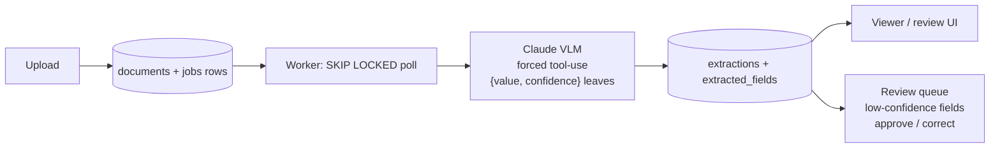

# doc-pilot

[](https://github.com/Antheagao/doc-pilot/actions/workflows/ci.yml)

AI document intelligence: upload messy real-world documents (receipts, invoices, IDs, forms) → a vision-language model extracts structured data → low-confidence fields route to a human review queue → clean data lands in Postgres with a full audit trail and per-document cost tracking.

## Screenshots


*The split view: the original document beside what the model extracted. Every field carries its own confidence score. The subtotal here was misread off a skewed phone photo at 68% confidence, routed to review, and corrected by a human — the model's original answer stays visible, struck through, beside the correction.*


*The review queue: only the individual fields that fell below the confidence threshold, not whole documents. Approve or correct inline; the header badge tracks pending count.*


*Upload via drag-and-drop and watch documents move `uploaded` → `processing` → `extracted`, polled live.*

## Planned architecture

- **Backend:** FastAPI (Python)
- **VLM:** Claude via the Anthropic API — image input with structured outputs (JSON schema), never regex-parsing free text
- **Queue:** Postgres `SKIP LOCKED` job queue
- **Frontend:** Next.js — upload, extraction results side-by-side with the document image, review/correct UI

## Core principles

- Evals from day one: labeled document set in `evals/`, field-level accuracy scored per model/prompt version
- Human-in-the-loop: low-confidence fields go to a review queue; corrections become new eval cases
- Cost & latency tracked per document
- Prompts and schemas versioned as code

## Quickstart

Three terminals, in order:

```powershell
git clone <this repo> doc-pilot
cd doc-pilot

# Postgres (host port 5434 -- 5432/5433 are already taken by other local
# projects, so the compose file remaps to avoid colliding with them)
docker compose up -d db

# Backend setup (one-time)
cd backend
python -m venv .venv
.venv\Scripts\Activate.ps1
pip install -e .[dev]
copy .env.example .env
# edit .env and set ANTHROPIC_API_KEY=sk-ant-...
alembic upgrade head
```

**Terminal 1 -- API** (from `backend/`, venv active):

```powershell
uvicorn app.main:app --reload
```

**Terminal 2 -- worker** (from `backend/`, venv active):

```powershell
python -m app.worker
```

**Terminal 3 -- frontend:**

```powershell
cd frontend
npm install
npm run dev
```

Open http://localhost:3000, upload a file from [`samples/`](samples/) (or generate fresh ones with `python backend/scripts/make_samples.py`), and watch it go `uploaded` -> `extracted` with per-field confidence.

## Architecture



Key decisions:

- **Postgres `SKIP LOCKED` instead of Redis** for the job queue -- one fewer moving part to run and explain, and the queue lives in the same transactional store as the data it's producing, so a claimed-but-crashed job is just a row to reconcile on worker startup rather than a separate failure mode to reason about.
- **Per-field confidence, not a single document-level score** -- the extraction tool forces every leaf into `{value, confidence}`, so the review queue routes individual low-confidence *fields* to a human rather than re-doing an entire document.
- **Prompts as versioned files** (`backend/prompts/extract_v1.md`), not inline strings -- extraction rows store the `prompt_version` they were produced with, so eval results can be tied to a specific prompt revision as prompts iterate.
- **Cost and latency tracked per document** -- every extraction row records input/output tokens, computed `cost_usd`, and `latency_ms`. Real numbers on `claude-sonnet-5`: roughly **$0.009 and ~4s per receipt**.

## Human review

Fields extracted with confidence below `review_threshold` (default 0.8, see `backend/app/config.py`) are flagged `needs_review` and land in a field-level work queue -- `GET /review/queue` on the backend, the **Review** page (with a pending-count badge in the header) on the frontend. A reviewer either **approves** the extracted value or **corrects** it; either way the resolution is stamped with `reviewed_at` and `review_action`, and a correction is stored in `corrected_value` *beside* the model's original answer, never over it -- the audit trail keeps what the model actually said. Resolving the same field twice is a 409: the first human decision wins until someone deliberately revisits it.

The loop closes with `python scripts/harvest_corrections.py` (from `backend/`): every document whose flagged fields have all been resolved is exported as a new eval case under `evals/` -- corrections become the label, approved and high-confidence values are kept as-is, and each exported label records its `source_document_id` so re-running only harvests new documents. Every harvested label passes the same loud validation the eval loader applies before it is kept, so a hand-typed correction in the wrong format is rejected at harvest time instead of poisoning the dataset.

## Security model

doc-pilot is currently a **single-user local tool** and its security posture is scoped to that: there is no authentication, because everything binds to localhost and the only user is the person running it. What *is* enforced regardless of deployment:

- **Uploads are verified, not trusted.** The client's Content-Type must be on the allowlist, the file's magic bytes must actually match that type (a payload claiming `image/png` without a PNG signature is rejected with 415), the storage filename is a server-generated UUID with an extension derived from the *verified* type (never from the client filename), and oversized bodies are aborted at the ASGI layer before they reach disk.
- **Re-serving is locked down.** Files are served back with their stored content type plus `X-Content-Type-Options: nosniff`, closing the stored-payload-served-as-image pattern from both ends.
- **No injection surfaces.** All SQL goes through the ORM with bound parameters; the frontend renders extracted values as React text nodes (VLM output is treated as untrusted data, never HTML); document content reaches the model under forced tool-choice with a fixed schema, and the eval corpus includes an adversarial prompt-injection case to measure that boundary.
- **The dev database binds to loopback only**, so its dev-grade credentials are never LAN-reachable.

**Before the hosted demo ships**, the threat model changes and three things become blocking: some form of auth (even a single bearer token), rate limiting with a daily spend cap (every upload triggers a billed VLM call — unauthenticated internet traffic means unbounded API spend at ~$0.01/document), and a storage quota with cleanup for uploads.

## Evals

Every extraction is scored against a synthetic-but-messy, PII-free corpus of labeled receipts/invoices in `evals/` -- generated with the correct answer known up front (not hand-transcribed from real documents), so the set doubles as a regression suite rather than a noisy guess. Each field has its own match rule: currency is an exact string match, dates are normalized to ISO-8601 before comparing, dollar amounts tolerate ±1 cent (compared in integer cents to dodge float rounding error), vendor names use fuzzy string matching (>=0.85 ratio), and line items must match item-for-item, in order. Every result is tied to the `(model, prompt_version, dataset_version)` triple it was produced with, so accuracy tracks across prompt iterations instead of floating in isolation -- the project rule is that a new prompt version only ships once an eval run proves it. The `caught_by_review` metric -- the share of incorrect fields the model itself flagged with low confidence -- is the empirical justification for routing low-confidence fields to a human review queue instead of trusting every extraction blindly.

On this dataset Haiku costs ~2.4x less per document than Sonnet ($0.0052 vs $0.0125) at a 4.0-point accuracy difference (95.4% vs 99.4%) -- the eval table is how that trade-off stays measurable as prompts change.

<!-- EVAL_TABLE:START -->

### Accuracy

| Model | Prompt | Docs | Overall | Vendor | Date | Currency | Subtotal | Tax | Total | Line items |
| --- | --- | --- | --- | --- | --- | --- | --- | --- | --- | --- |
| claude-sonnet-5 | extract_v1 | 3 | 100.0% | 100.0% | 100.0% | 100.0% | 100.0% | 100.0% | 100.0% | 100.0% |
| claude-sonnet-5 | extract_v1 | 25 | 99.4% | 100.0% | 100.0% | 96.0% | 100.0% | 100.0% | 100.0% | 100.0% |
| claude-haiku-4-5 | extract_v1 | 25 | 95.4% | 100.0% | 96.0% | 96.0% | 96.0% | 96.0% | 96.0% | 88.0% |

*Percentages are field-level accuracy (see this README's Evals section for the per-field match rules); Docs is n_scored for that run, with `+N err` appended when the run had N extraction errors. Each row is one eval run, tied to its own model / prompt_version / dataset_version, ordered oldest to newest by started_at_utc.*

### Ops

| Model | Prompt | Conf ✓/✗ | Caught by review | Halluc. | $/doc | Total $ | p50/p95 latency |
| --- | --- | --- | --- | --- | --- | --- | --- |
| claude-sonnet-5 | extract_v1 | 0.97 / n/a | n/a | 0 | $0.0110 | $0.0329 | 4368ms / 5943ms |
| claude-sonnet-5 | extract_v1 | 0.96 / 0.60 | 100.0% | 1 | $0.0125 | $0.3123 | 5165ms / 12929ms |
| claude-haiku-4-5 | extract_v1 | 0.96 / 0.93 | 0.0% | 1 | $0.0052 | $0.1305 | 3651ms / 8414ms |

*Conf ✓/✗ is mean model confidence on correct vs. incorrect fields; Caught by review is the share of incorrect fields whose confidence fell below that run's review_threshold -- the empirical case for the human-review queue; $/doc and Total $ are extraction spend in USD; latency is wall-clock p50/p95 per document.*

<!-- EVAL_TABLE:END -->

*Status: the full loop is working -- upload -> extract -> view -> human review -> corrections harvested back into the eval set -- with CI running the whole test suite against Postgres on every push. Next: a hosted demo.*
