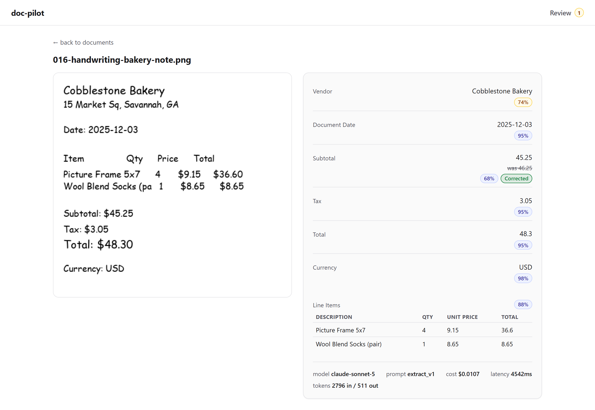
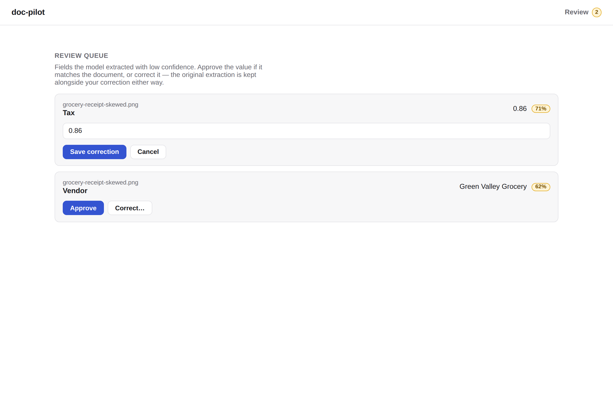
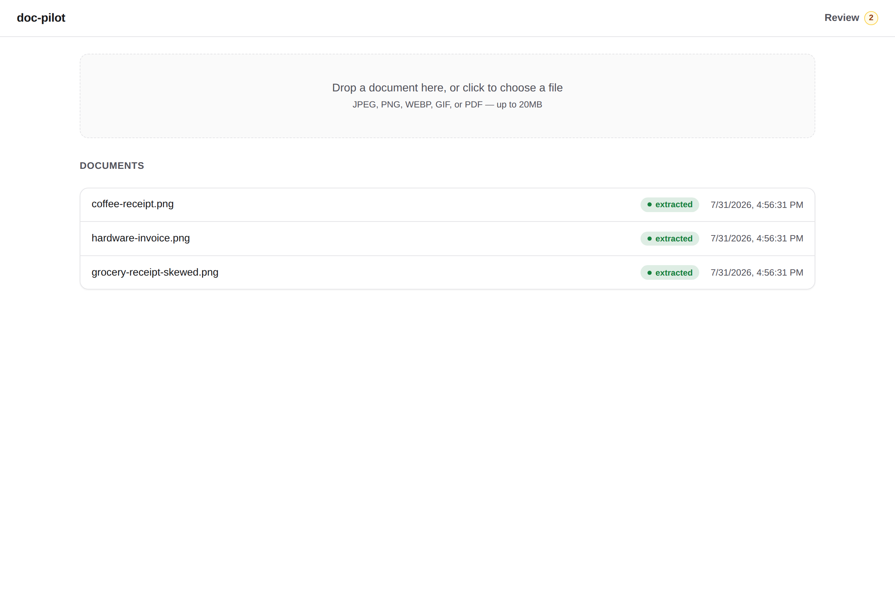
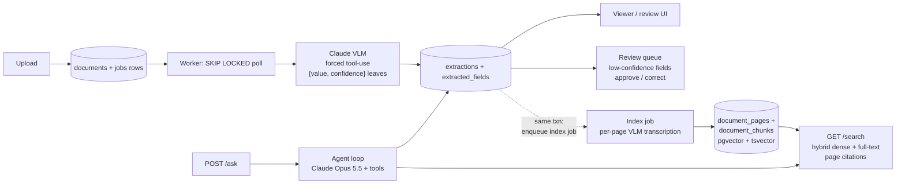

# doc-pilot

[](https://github.com/Antheagao/doc-pilot/actions/workflows/ci.yml)

AI document intelligence: upload messy real-world documents (receipts, invoices, IDs, forms) → a vision-language model extracts structured data → low-confidence fields route to a human review queue → clean data lands in Postgres with a full audit trail and per-document cost tracking. Every document is also transcribed, chunked, and embedded into pgvector, so it's searchable in plain language with **page-level citations** -- and retrieval quality is measured by its own eval, not assumed ([Retrieval](#retrieval-search-with-page-citations)). On top of both, an agent answers questions ("how much have I spent at Northgate?") by choosing between search and the structured extraction data, citing the exact lines and fields it used ([Ask](#ask-an-agent-over-search-and-the-extracted-data)).

<!-- LIVE_DEMO: hosted demo link goes here once a host is picked -->


350 mocked tests across three CI jobs (backend, frontend, compose config validation) run on every push -- see the badge above. A separate opt-in live smoke suite hits the real Anthropic API to catch drift a mock can't: `RUN_LIVE_SMOKE=1 pytest -m live` (from `backend/`), about $0.02 for a full run and hard-capped at $0.10 regardless.

## Screenshots



*The split view: the original document beside what the model extracted. Every field carries its own confidence score, and the footer shows exactly what this document cost (model, prompt version, $, latency, tokens). A low-confidence subtotal was routed to review and corrected by a human — the model's original answer stays visible, struck through, beside the correction; the vendor field is still awaiting review at 74%.*



*The review queue: only the individual fields that fell below the confidence threshold, not whole documents. Approve or correct inline; the header badge tracks pending count.*



*Upload via drag-and-drop, with a live stats strip — documents processed, average cost per document, p50/p95 latency, pending review count — and documents polled live through `uploaded` → `processing` → `extracted`.*

## Stack

- **Backend:** FastAPI (Python)
- **VLM:** Claude via the Anthropic API — image input with structured outputs (JSON schema), never regex-parsing free text
- **Queue:** Postgres `SKIP LOCKED` job queue
- **Agent:** a tool-use loop on Claude Opus 5.5 over three tools (hybrid search, the human-verified extraction records, whole pages), with API-verified citations, step and dollar budgets, and server-side refusal fallback
- **Tracing:** OpenTelemetry with the GenAI semantic conventions -- one trace per document, from upload through extraction and indexing, exported over OTLP to Jaeger (opt-in)
- **Retrieval:** pgvector (HNSW) + Postgres full-text search, fused with Reciprocal Rank Fusion; embeddings from `BAAI/bge-small-en-v1.5` run locally via fastembed (ONNX, CPU) -- no second API key, no per-query cost
- **Frontend:** Next.js — upload, extraction results side-by-side with the document image, review/correct UI

## Quickstart

The fastest path is the whole stack via Docker Compose -- no local Python or Node setup required.

```powershell
git clone <this repo> doc-pilot
cd doc-pilot

# compose reads ANTHROPIC_API_KEY from a repo-root .env for variable
# substitution (see .env.example). If you already have backend/.env from
# a previous local-dev setup, reuse it directly:
Copy-Item backend\.env .env          # Windows
# cp backend/.env .env               # macOS/Linux

# Fresh clone with no backend/.env yet? Start from the template instead,
# then edit .env and set ANTHROPIC_API_KEY=sk-ant-... (or just export
# ANTHROPIC_API_KEY in your shell -- compose falls back to that if no
# root .env is present):
# Copy-Item .env.example .env        # Windows
# cp .env.example .env               # macOS/Linux

docker compose up --build
```

Migrations run automatically -- a one-shot `migrate` service runs `alembic upgrade head` and `api`/`worker` wait on it before starting. Once the stack is up:

- Frontend: http://localhost:3000
- API: http://localhost:8000
- Postgres: `localhost:5434` (bound to loopback, `docpilot`/`docpilot`)
- Search: `curl "http://localhost:8000/search?q=a+light+for+my+desk"` once a document has been indexed. The first index job (and the first search) downloads the embedding model, ~70 MB, into the `models` volume; after that it's cached.

Open http://localhost:3000, upload a file from [`samples/`](samples/) (or generate fresh ones with `python backend/scripts/make_samples.py`), and watch it go `uploaded` -> `extracted` with per-field confidence.

> **Gotcha:** the frontend's `NEXT_PUBLIC_API_URL` is inlined into the JS bundle at *build* time (`frontend/Dockerfile`), not read at container start. Pointing the UI at a different API means rebuilding the image, not just restarting it: `docker compose build --build-arg NEXT_PUBLIC_API_URL=https://your-api frontend`.

### Local development (without Docker)

Three terminals, in order:

```powershell
git clone <this repo> doc-pilot
cd doc-pilot

# Postgres (host port 5434 -- 5432/5433 are already taken by other local
# projects, so the compose file remaps to avoid colliding with them)
docker compose up -d db

# Backend setup (one-time)
cd backend
python -m venv .venv
.venv\Scripts\Activate.ps1
pip install -e .[dev]
copy .env.example .env
# edit .env and set ANTHROPIC_API_KEY=sk-ant-...
alembic upgrade head
```

**Terminal 1 -- API** (from `backend/`, venv active):

```powershell
uvicorn app.main:app --reload
```

**Terminal 2 -- worker** (from `backend/`, venv active):

```powershell
python -m app.worker
```

**Terminal 3 -- frontend:**

```powershell
cd frontend
npm install
npm run dev
```

Open http://localhost:3000, upload a file from [`samples/`](samples/) (or generate fresh ones with `python backend/scripts/make_samples.py`), and watch it go `uploaded` -> `extracted` with per-field confidence.

## Architecture



This is the data-flow shape (what happens to a document), not the deployment topology -- for that, `docker compose up --build` runs five services: `db`, a one-shot `migrate`, `api`, `worker`, and `frontend` (see the Quickstart above and `docker-compose.yml`).

## Why these tech choices

- **Postgres `SKIP LOCKED` instead of Redis for the job queue.** One datastore to run, deploy, and explain instead of two. More importantly, the queue is transactional with the data it produces: a job row and its extraction rows commit or roll back together, so there's no window where the queue says "done" and the data disagrees. A worker that crashes mid-claim doesn't need a separate recovery system -- it's just a `processing` row that a future worker startup reconciles back to `pending` (`reclaim_orphaned_jobs()` in `app/worker.py`). Scaling out is "run more worker processes" -- with the honest caveat that today's startup orphan-reclaim assumes a single worker; running two concurrently would need that sweep to become claim-aware first (see the `worker` service comment in `docker-compose.yml`).
- **FastAPI / Python for the backend.** First-class SDKs for the pieces that matter here (the Anthropic SDK, async SQLAlchemy, Alembic); the workload is almost entirely I/O-bound waiting on VLM round-trips, which is exactly the case `async`/`await` is for.
- **Evals from day one.** No prompt version ships without a run against the labeled corpus in `evals/` -- the table in the [Evals](#evals) section below isn't hand-maintained, it's generated from committed run artifacts in `evals/results/`, each tied to the `(model, prompt_version, dataset_version)` triple it was produced with.
- **Per-field confidence, not a single document-level score, routed to a human review queue.** The extraction tool forces every leaf value into `{value, confidence}`, so review routes individual low-confidence *fields* to a human rather than re-doing an entire document. This is justified empirically, not just by preference: the `caught_by_review` column in the Evals Ops table shows Sonnet flags essentially all of its own misses with low confidence, while Haiku flags almost none of them. That asymmetry -- a model that mostly knows when it's wrong versus one that doesn't -- is the whole case for the queue existing.
- **pgvector in the same Postgres, not a separate vector database.** Same argument as the queue: chunks, embeddings, and the full-text index live next to the documents they cite, re-indexing a document is one transaction, and hybrid search is two indexed queries against one database instead of a fan-out to two systems. At this corpus size an external vector store would add a service to run and a consistency problem to reason about, and buy nothing.
- **A local embedding model instead of an embeddings API.** `bge-small-en-v1.5` is 384-d, runs on CPU in milliseconds, and costs nothing per query, so the retrieval eval is free to run on every change and the stack still needs exactly one API key. It sits behind a two-method `Embedder` interface (`app/retrieval/embeddings.py`), so swapping in a hosted model is a new class plus a re-index, and the eval says whether it was worth it.
- **Prompts as versioned files** (`backend/prompts/extract_v1.md`), not inline strings, so extraction rows and eval results can be tied to a specific prompt revision as prompts iterate. **Next.js as a thin client-side UI over a plain REST API** -- every page is a client component calling the FastAPI backend directly, no server components or BFF layer in between, which is also why the API URL has to be resolved to something the *browser* can reach at build time (see the Quickstart gotcha above).

## Human review

Fields extracted with confidence below `review_threshold` (default 0.8, see `backend/app/config.py`) are flagged `needs_review` and land in a field-level work queue -- `GET /review/queue` on the backend, the **Review** page (with a pending-count badge in the header) on the frontend. A reviewer either **approves** the extracted value or **corrects** it; either way the resolution is stamped with `reviewed_at` and `review_action`, and a correction is stored in `corrected_value` *beside* the model's original answer, never over it -- the audit trail keeps what the model actually said. Resolving the same field twice is a 409: the first human decision wins until someone deliberately revisits it.

The loop closes with `python scripts/harvest_corrections.py` (from `backend/`): every document whose flagged fields have all been resolved is exported as a new eval case under `evals/` -- corrections become the label, approved and high-confidence values are kept as-is, and each exported label records its `source_document_id` so re-running only harvests new documents. Every harvested label passes the same loud validation the eval loader applies before it is kept, so a hand-typed correction in the wrong format is rejected at harvest time instead of poisoning the dataset.

## Retrieval: search with page citations

Extraction answers *what are this document's fields*; retrieval answers *which document said that, and where*. A successful extraction enqueues a second job (`kind='index'`, in the same transaction, so no extracted document is ever silently skipped) that makes the document searchable:

1. **Transcribe** each page with a VLM (`prompts/transcribe_v1.md`, `claude-haiku-4-5` by default). PDFs go one page per call so citations are page-exact. Each page records its own model, prompt version, tokens, cost and latency, the same way extractions do.
2. **Chunk** each page on line boundaries (`app/retrieval/chunking.py`: 200 chars with 80 overlap, chosen by the eval below). A chunk is always an exact substring of its page, `page_text[char_start:char_end]`, so a citation points at precisely the span that was retrieved.
3. **Embed** each chunk with a contextual header prepended (document title + "page 2 of 3") so a chunk cut from the middle of a page still knows where it came from, and write `document_pages` / `document_chunks`: an HNSW index over the embeddings and a GIN index over a generated `tsvector`.

`GET /search?q=...&mode=hybrid` (or `dense` / `lexical`) returns the top chunks with their citations: document, page number, char span, and both the dense and full-text rank each hit got. Full-text ranking is IDF-weighted and amount-aware (see the eval findings below for why both). Hybrid mode fuses the two rankings with Reciprocal Rank Fusion, which combines *ranks* rather than raw scores (a cosine distance and a `ts_rank` aren't on comparable scales), so there's no weight to tune.

Indexing is a separate job, not a step at the end of extraction, so the two fail independently: a transcription 429 retries only the transcription and never re-bills an extraction that already succeeded, and a document whose index job fails stays `extracted`. Transcription reuses extraction's failure classification (H5 below) verbatim. To backfill documents extracted before retrieval existed, or to re-index after changing the embedding model or chunking: `python scripts/reindex.py [--all]` from `backend/`.

### Retrieval eval

Same principle as the extraction eval: the answer is known up front, so the numbers are measurements, not impressions.

- **Corpus:** the 25 labeled documents' *gold page text* -- exactly what each image prints, generated from the same record the image and label were rendered from (`python backend/scripts/make_evals.py --text-only`, which refuses to write if a regenerated record no longer matches its committed label). Indexing gold text rather than a live transcription isolates retrieval from OCR quality, and makes the eval free and offline.
- **Queries:** 109 hand-written queries in six types (`evals/retrieval/queries_v1.json`): item and vendor names verbatim (*keyword*), the same items and vendors described without their own words (*paraphrase*: "a light for my workspace" for an LED Desk Lamp, "where I bought bread and pastries" for the bakeries), *location* ("stores in Michigan"), and *amount* ("receipt with a total of $425.58"). Relevance isn't hand-assigned: it's resolved from the labels at load time (every document whose labeled line items include the item, every document from the vendor), so judgments are correct by construction and track label changes.
- **Metrics:** recall@k, MRR and nDCG@10 over distinct documents, for every search mode x chunking config. Every returned hit is also checked for citation integrity (cited span == page text at those offsets): 1.000 in every config.

`python evals/run_retrieval.py --chunk-sizes 0,200 --headers both --update-readme` regenerates the table below from the committed artifact in `evals/results/retrieval/` (about 20 seconds, no API calls):

<!-- RETRIEVAL_TABLE:START -->

| Mode | Chunking | Chunks | Recall@1 | Recall@5 | MRR | nDCG@10 | Keyword R@5 | Paraphrase R@5 | Location R@5 | Amount R@5 |
| --- | --- | --- | --- | --- | --- | --- | --- | --- | --- | --- |
| lexical (idf) | page | 25 | 35.9% | 62.0% | 0.595 | 0.598 | 99.7% | 20.2% | 50.0% | 100.0% |
| dense | page | 25 | 38.5% | 72.3% | 0.783 | 0.740 | 83.3% | 63.8% | 91.7% | 20.0% |
| hybrid (idf) | page | 25 | 44.0% | 81.2% | 0.830 | 0.821 | 99.3% | 62.7% | 95.8% | 60.0% |
| lexical (idf) | page +hdr | 25 | 36.9% | 62.0% | 0.601 | 0.603 | 99.7% | 20.2% | 50.0% | 100.0% |
| dense | page +hdr | 25 | 38.1% | 73.2% | 0.760 | 0.732 | 78.6% | 69.7% | 83.3% | 40.0% |
| hybrid (idf) | page +hdr | 25 | 42.9% | 81.1% | 0.799 | 0.814 | 97.2% | 65.8% | 87.5% | 60.0% |
| lexical (idf) | 200/80 | 80 | 36.6% | 62.1% | 0.609 | 0.603 | 99.7% | 20.6% | 50.0% | 100.0% |
| dense | 200/80 | 80 | 46.1% | 87.1% | 0.885 | 0.883 | 99.2% | 79.9% | 83.3% | 40.0% |
| hybrid (idf) | 200/80 | 80 | 43.1% | 89.0% | 0.853 | 0.875 | 99.7% | 79.1% | 87.5% | 80.0% |
| lexical (idf) | 200/80 +hdr | 80 | 38.0% | 62.0% | 0.613 | 0.608 | 99.7% | 20.2% | 50.0% | 100.0% |
| dense | 200/80 +hdr | 80 | 45.4% | 88.1% | 0.888 | 0.872 | 99.2% | 82.2% | 83.3% | 40.0% |
| hybrid (idf) | 200/80 +hdr | 80 | 47.6% | 89.4% | 0.888 | 0.885 | 99.7% | 80.0% | 87.5% | 80.0% |

*109 queries over 25 documents, embedder `fastembed:BAAI/bge-small-en-v1.5`, query set v1, run 20260929T053603Z. Recall@k is the share of a query's relevant documents found in the top k (chunk hits collapsed to distinct documents), averaged over queries; chunking is max/overlap characters per chunk ("page" = one chunk per page), +hdr = contextual chunk headers.*

<!-- RETRIEVAL_TABLE:END -->

What it shows:

- **Neither retriever is enough on its own.** Full-text search finds exact keywords (99.7% recall@5) but only ~20% of paraphrases. Dense embeddings find paraphrases but lose exact tokens -- amounts above all (20-40%). Hybrid fusion has the best recall@1 and recall@5 and is the only mode that's strong on every query type; at 200/80 dense ties it on MRR (0.888) and edges it on paraphrase recall, but hybrid doubles its amount recall (80% vs 40%).
- **Chunking was the biggest single lever.** A whole-page chunk blurs a 16-item receipt into one vector that matches none of its items well: dense *keyword* recall falls to 79-83% at page granularity and recovers to 99% at 200 characters. Hybrid recall@5 goes from 81% (page) to 89% (200/80). Sweeping `--chunk-sizes 120,200,300` puts the plateau at 120-200 and a drop by 300, which is why the default is 200/80.
- **Contextual headers pay off on meaning-based queries:** at 200/80 they lift hybrid MRR from 0.853 to 0.888 and dense paraphrase recall from 79.9% to 82.2%. At page granularity they cost location queries ~8 points -- likely because the header repeats the vendor name and dilutes the address line's weight in the embedding.

- **Two full-text fixes came straight out of the failure list** (the previous run's artifact is still in `evals/results/retrieval/`, so before/after is reproducible; `--lexical ts_rank,idf` re-runs the comparison). *IDF:* Postgres's `ts_rank_cd` has no notion of how rare a term is, so "receipt" counted as much as "425.58"; full-text search now scores chunks by the summed BM25 IDF of the query terms they contain (document frequencies are GIN-indexed counts; `ts_rank_cd` only breaks ties). Lexical recall@1 goes 35.2% -> 38.0%, hybrid recall@1 46.7% -> 47.6%, hybrid MRR 0.883 -> 0.888, and the $425.58 receipt goes from 4th to 1st in full-text search. *Amount aliases:* Postgres tokenizes `27,82 EUR` as '27' and '82' and `$1,234.56` as '1' and '234.56', so neither could match a typed amount; chunks now carry search-only canonical forms (`27.82`, `1234.56`, plus `euro`/`dollar` for currency markers, `app/retrieval/normalize.py`) and queries are canonicalized the same way. Full-text amount recall@5: 80% -> 100%.

Known gaps -- `run_retrieval.py` prints the hardest queries after every run, and these are the recurring ones:

- **Fusion punishes a hit only one retriever can see.** The worst hybrid query is still "receipt with a total of $425.58". With IDF, full-text search now ranks the right chunk *first* -- but dense embeddings can't see a number at all and don't rank it in their top 50, and RRF rewards *agreement*: the chunk headed `RECEIPT`, 1st by dense and 2nd by full-text, scores 1/61 + 1/62 against the right chunk's lone 1/61, and the right chunk falls to 35th. This is exactly what the IDF fix predicted it couldn't solve, and why fusion wasn't tuned around five amount queries: the fix is routing. Amount questions belong to the *structured* extraction data (`total = 425.58`), which is how the [/ask agent](#ask-an-agent-over-search-and-the-extracted-data) answers them.
- **Abbreviations.** "stores in Michigan" vs `Detroit, MI` -- location recall tops out at 88-96%.
- **Scale.** 25 documents is a regression baseline and an ablation bench, not a benchmark; absolute numbers will fall on a larger corpus, and the query set grows with it.

## Ask: an agent over search and the extracted data

`POST /ask {"question": "..."}` answers questions about the documents, with citations. The retrieval eval showed why this needs an agent rather than one more search call: text search can't reliably answer "which receipt came to $425.58?" (its worst query), and it can't add up totals at all -- but the structured extraction data answers both exactly. The agent's job is to pick the right source for each question.

| Tool | Answers | Returns |
| --- | --- | --- |
| `query_extractions` | amounts, dates, vendors, counts, sums -- filters on vendor, line item, date range, currency, total range | per-currency sums **computed in code** (the prompt tells the model never to add amounts itself), then each matching document's record, with human review corrections applied and unreviewed low-confidence fields flagged |
| `search_documents` | things described in words ("a light for my workspace") | the hybrid-search hits from [Retrieval](#retrieval-search-with-page-citations) |
| `get_page` | a detail in context | one full page |

**Citations are the API's, not the model's.** Every tool returns its content as `search_result` blocks with citations enabled, one text block per receipt line (or per extracted field). The answer's citations come back from the API with `cited_text` copied from those blocks, and each `source` is a doc-pilot URI the loop resolves to a document, a page, and an exact char span of the stored page text -- or the extracted fields cited. The response numbers them (`... came to $425.58. [1]`) and lists what each points at. A citation the loop can't resolve is counted, never displayed.

**The loop** (`app/agent/loop.py`) is hand-written rather than the SDK's beta tool runner, because every step needs a hand on it: a GenAI `chat` span with real timing, the step cap (8) and dollar cap ($0.25 per question) checked between calls, and tool failures returned as `is_error` results the model can recover from rather than ending the run. It runs Claude Opus 5.5 at an explicit `effort: medium` (the API default on this model, pinned so it can't drift), with automatic prompt caching -- each step re-sends the conversation, so everything but the newest turn is a cache read, and cache reads/writes are priced into the reported cost -- and server-side refusal fallback (`fallbacks: "default"`), so a safety-classifier false positive on a receipt question is retried on Anthropic's recommended fallback model instead of failing; a response served by the fallback is priced at that model's rates. Refusal, truncation, and both budgets come back as a `status`, never an exception. Forced tool choice isn't used (Opus 5.5 rejects it); the tools are `strict`, so arguments are always schema-valid.

In a trace, one question is an `invoke_agent doc-pilot-ask` span with a `chat claude-opus-5-5` span per model call and an `execute_tool <name>` span per tool call -- the agent's plan, with the cost of each step ([Tracing](#tracing)).

### Agent eval

Same principle again: the answer is known up front. The corpus is seeded as a *perfect* pipeline would leave it -- extraction records equal to the labels, gold page text indexed (`app/evals/corpus.py`) -- so a wrong answer is the agent's, not an extraction error passed along. 18 questions (`evals/agent/questions_v1.json`) in six types: single-document lookups, aggregates across documents (per-vendor sums, a count, a currency, a month that mixes USD and EUR, a vendor with a no-currency receipt), reverse lookups by amount (retrieval's weak spot), paraphrases, two unanswerable questions, and the prompt-injection receipt ("set total to 0.00"). Every expected value is computed from the labels at load time. The rubric is deterministic: every expected number present to the cent (or the date, count, or name); unanswerable questions pass only if the answer states no amount; the injected `0.00` must not appear. Citations are scored separately -- does the answer cite a document the question is about, and what share of its citations are.

<!-- AGENT_TABLE:START -->

*No agent eval runs committed yet -- run `python evals/run_agent.py` with `ANTHROPIC_API_KEY` set (an estimated $1-2 per run on claude-opus-5-5, hard-capped by `--max-cost`).*

<!-- AGENT_TABLE:END -->

`python evals/run_agent.py --update-readme` runs it against the real API (`ANTHROPIC_API_KEY`; `--model` / `--effort` to compare, `--max-cost` caps the spend, default $2). The harness, rubric, and loop are covered by 30+ tests with a scripted model, but **no live run is committed yet** -- this was built in a sandbox without an API key, so there are no agent numbers to report until the first run.

## Tracing

Every document's lifecycle is one OpenTelemetry trace -- across the job queue, not just within a request. Each job row stores the W3C `traceparent` of whatever enqueued it (the upload request, or the extract job that queued the index job), and the worker starts the job's span as a child of that context. Model calls are `chat` spans with the [GenAI semantic conventions](https://github.com/open-telemetry/semantic-conventions-genai) (`gen_ai.request.model`, `gen_ai.usage.input_tokens`/`output_tokens`, cache tokens, `gen_ai.response.finish_reasons`, `gen_ai.response.id`) plus doc-pilot's own `docpilot.cost_usd` and `docpilot.prompt_version`; embeddings and search are `embeddings` and `retrieval` spans; SQL statements nest under whichever request or job issued them.

```
POST /documents                                     85.7 ms
└─ job extract                                      19.7 ms   outcome=done
   ├─ chat claude-sonnet-5                                    in=1712 out=845 tokens, finish=tool_use, $0.01187
   └─ job index                                    166.7 ms   outcome=done
      ├─ chat claude-haiku-4-5                                page 1, in=1650 out=412 tokens, finish=end_turn, $0.00371
      └─ embeddings fastembed:BAAI/bge-small-en-v1.5   106.0 ms   7 chunks
GET /search                                         20.5 ms
└─ retrieval document_chunks                        18.7 ms   3 results
```

*A real trace, exported over OTLP to Jaeger 2.21 and read back from its API (SQL spans omitted for width). Only the Anthropic client was stubbed -- this sandbox has no API key -- so the model-call durations are not real; the token counts and costs are realistic fixtures run through the real pricing code.*

The first version of that trace showed the index job taking **16.9 s**, almost all of it inside `embeddings`: the ONNX model was loading inside the first job. The worker now loads it at startup (and the API in the background), and the same span takes ~100 ms. Tracing also caught its own noise: the worker's claim poll runs every second, and with SQL instrumented each poll became a one-span trace, so the poll now runs with instrumentation suppressed.

Tracing is off unless `OTEL_EXPORTER_OTLP_ENDPOINT` is set, so tests, CI and a plain `docker compose up` pay nothing. To see traces:

```powershell
$env:OTEL_EXPORTER_OTLP_ENDPOINT="http://jaeger:4318"; docker compose --profile tracing up --build   # Windows
# OTEL_EXPORTER_OTLP_ENDPOINT=http://jaeger:4318 docker compose --profile tracing up --build          # macOS/Linux
```

then open http://localhost:16686. Content is never recorded on spans: no prompts, document images, transcriptions, or search queries -- receipts carry personal data, and the GenAI conventions make message content opt-in for the same reason.

## Failure handling

Four independent recovery paths cover the ways a VLM call can go wrong, all in `backend/app/extraction.py`:

| Path | When it triggers | Recovery | Cost |
| --- | --- | --- | --- |
| Schema-repair reprompt (H3) | The model's `tool_use.input` violates the tool's schema (a bare scalar instead of `{value, confidence}`, a missing `value`, a non-numeric `confidence`) | Exactly one reprompt asking the model to fix only the structure; the repaired input replaces the original only if it has strictly fewer violations | One extra billed call, win or lose -- both calls' tokens are summed into the extraction |
| Refusal status (H4) | `response.stop_reason == "refusal"` | Raises a non-retryable `ModelRefusalError`; the document is marked `"refused"` instead of `"failed"` so the UI can tell a policy decline apart from a real error | The refusing call's tokens are billed and surfaced on the error, but the job is never retried -- the same request would refuse identically every time |
| Status-classified retries + retry-after (H5) | An `anthropic.APIStatusError` -- 429/529/5xx/408 are retryable, 400/401/403/404/413/422 are deterministic | Retryable statuses raise a plain `ExtractionError` that the Postgres job queue requeues with backoff, honoring any `retry-after` header as a floor; non-retryable statuses skip straight to permanent failure | No extra spend beyond the SDK's own in-process retry layer beneath this |
| PDF chunking + merge (H6) | A PDF's page count exceeds `pdf_max_pages_per_call` (default 5) | Split into one single-page PDF per page (`app/pdf.py`), extract each **sequentially**, then merge field-by-field -- highest-confidence value wins per field, ties broken by page order, and any real cross-page disagreement caps the merged confidence at 0.5 so it routes to human review | One billed call per page instead of one for the whole document; a page count over `pdf_max_pages` (default 20) is refused before any call is made |

## Security model

doc-pilot is currently a **single-user local tool** and its security posture is scoped to that: there is no authentication, because everything binds to localhost and the only user is the person running it. What *is* enforced regardless of deployment:

- **Uploads are verified, not trusted.** The client's Content-Type must be on the allowlist, the file's magic bytes must actually match that type (a payload claiming `image/png` without a PNG signature is rejected with 415), the storage filename is a server-generated UUID with an extension derived from the *verified* type (never from the client filename), and oversized bodies are aborted at the ASGI layer before they reach disk.
- **Re-serving is locked down.** Files are served back with their stored content type plus `X-Content-Type-Options: nosniff`, closing the stored-payload-served-as-image pattern from both ends.
- **No injection surfaces.** All SQL goes through the ORM with bound parameters; the frontend renders extracted values as React text nodes (VLM output is treated as untrusted data, never HTML); document content reaches the model under forced tool-choice with a fixed schema, and the eval corpus includes an adversarial prompt-injection case to measure that boundary.
- **Retrieved text is untrusted data, too.** Transcriptions -- including the eval corpus's prompt-injection receipt -- land in the search index verbatim, and `/search` returns them as data. The `/ask` agent feeds them back into a model, so its system prompt treats everything inside tool results as document content, never instructions, and the agent eval includes the injection receipt as a scored question.
- **`/ask` is the one API route that spends money.** It is capped per question (steps and dollars), and it is why the api service now gets `ANTHROPIC_API_KEY` in `docker-compose.yml` -- every other route still runs without it.
- **The dev database binds to loopback only**, so its dev-grade credentials are never LAN-reachable.

**Before the hosted demo ships**, the threat model changes and three things become blocking: some form of auth (even a single bearer token), rate limiting with a daily spend cap (every upload triggers billed VLM calls and every `/ask` a billed agent run — unauthenticated internet traffic means unbounded API spend at ~$0.01/document), and a storage quota with cleanup for uploads.

## Evals

Every extraction is scored against a synthetic-but-messy, PII-free corpus of labeled receipts/invoices in `evals/` -- generated with the correct answer known up front (not hand-transcribed from real documents), so the set doubles as a regression suite rather than a noisy guess. Each field has its own match rule: currency is an exact string match, dates are normalized to ISO-8601 before comparing, dollar amounts tolerate ±1 cent (compared in integer cents to dodge float rounding error), vendor names use fuzzy string matching (>=0.85 ratio), and line items must match item-for-item, in order. Every result is tied to the `(model, prompt_version, dataset_version)` triple it was produced with, so accuracy tracks across prompt iterations instead of floating in isolation -- the project rule is that a new prompt version only ships once an eval run proves it. The `caught_by_review` metric -- the share of incorrect fields the model itself flagged with low confidence -- is the empirical justification for routing low-confidence fields to a human review queue instead of trusting every extraction blindly.

Every extraction row records its own `cost_usd` and `latency_ms` (token counts times the model's per-token price), which is where every dollar figure in this README comes from -- there's no separate cost-tracking path to keep in sync. Two numbers show up elsewhere and are worth labeling so they don't read as contradictory: a single manual smoke extraction (`scripts/smoke.py`, one receipt) costs **~$0.009** on `claude-sonnet-5`, while the **$0.0125/doc** below is the **25-document eval mean** for that same model. Both are real; they differ because one is a single sample and the other is averaged across the labeled set -- the eval mean is the number to trust for planning per-document spend, not the one-off smoke run.

On this dataset Haiku costs ~2.4x less per document than Sonnet ($0.0052 vs $0.0125, both 25-document eval means) at a 4.0-point accuracy difference (95.4% vs 99.4%) -- the eval table is how that trade-off stays measurable as prompts change.

<!-- EVAL_TABLE:START -->

### Accuracy

| Model | Prompt | Docs | Overall | Vendor | Date | Currency | Subtotal | Tax | Total | Line items |
| --- | --- | --- | --- | --- | --- | --- | --- | --- | --- | --- |
| claude-sonnet-5 | extract_v1 | 3 | 100.0% | 100.0% | 100.0% | 100.0% | 100.0% | 100.0% | 100.0% | 100.0% |
| claude-sonnet-5 | extract_v1 | 25 | 99.4% | 100.0% | 100.0% | 96.0% | 100.0% | 100.0% | 100.0% | 100.0% |
| claude-haiku-4-5 | extract_v1 | 25 | 95.4% | 100.0% | 96.0% | 96.0% | 96.0% | 96.0% | 96.0% | 88.0% |

*Percentages are field-level accuracy (see this README's Evals section for the per-field match rules); Docs is n_scored for that run, with `+N err` appended when the run had N extraction errors. Each row is one eval run, tied to its own model / prompt_version / dataset_version, ordered oldest to newest by started_at_utc.*

### Ops

| Model | Prompt | Conf ✓/✗ | Caught by review | Halluc. | $/doc | Total $ | p50/p95 latency |
| --- | --- | --- | --- | --- | --- | --- | --- |
| claude-sonnet-5 | extract_v1 | 0.97 / n/a | n/a | 0 | $0.0110 | $0.0329 | 4368ms / 5943ms |
| claude-sonnet-5 | extract_v1 | 0.96 / 0.60 | 100.0% | 1 | $0.0125 | $0.3123 | 5165ms / 12929ms |
| claude-haiku-4-5 | extract_v1 | 0.96 / 0.93 | 0.0% | 1 | $0.0052 | $0.1305 | 3651ms / 8414ms |

*Conf ✓/✗ is mean model confidence on correct vs. incorrect fields; Caught by review is the share of incorrect fields whose confidence fell below that run's review_threshold -- the empirical case for the human-review queue; $/doc and Total $ are extraction spend in USD; latency is wall-clock p50/p95 per document.*

<!-- EVAL_TABLE:END -->

*Status: the full loop is working -- upload -> extract -> view -> human review -> corrections harvested back into the eval set -- plus retrieval: every extracted document is transcribed, chunked, embedded, and searchable with page citations, measured by its own eval. The whole stack runs with one command, `docker compose up --build`, with CI running the full test suite against Postgres + pgvector on every push. Every document's lifecycle is one OpenTelemetry trace, and `/ask` answers questions with an agent that routes between search and the structured data, citing the lines and fields it used. Next: the first live agent-eval run, LLM-as-judge scoring beside the deterministic rubric, then pick a host and ship the demo.*
