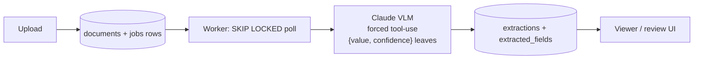

# doc-pilot

AI document intelligence: upload messy real-world documents (receipts, invoices, IDs, forms) → a vision-language model extracts structured data → low-confidence fields route to a human review queue → clean data lands in Postgres with a full audit trail and per-document cost tracking.

## Planned architecture

- **Backend:** FastAPI (Python)
- **VLM:** Claude via the Anthropic API — image input with structured outputs (JSON schema), never regex-parsing free text
- **Queue:** Postgres `SKIP LOCKED` job queue
- **Frontend:** Next.js — upload, extraction results side-by-side with the document image, review/correct UI

## Core principles

- Evals from day one: labeled document set in `evals/`, field-level accuracy scored per model/prompt version
- Human-in-the-loop: low-confidence fields go to a review queue; corrections become new eval cases
- Cost & latency tracked per document
- Prompts and schemas versioned as code

## Quickstart

Three terminals, in order:

```powershell
git clone <this repo> doc-pilot
cd doc-pilot

# Postgres (host port 5434 -- 5432/5433 are already taken by other local
# projects, so the compose file remaps to avoid colliding with them)
docker compose up -d db

# Backend setup (one-time)
cd backend
python -m venv .venv
.venv\Scripts\Activate.ps1
pip install -e .[dev]
copy .env.example .env
# edit .env and set ANTHROPIC_API_KEY=sk-ant-...
alembic upgrade head
```

**Terminal 1 -- API** (from `backend/`, venv active):

```powershell
uvicorn app.main:app --reload
```

**Terminal 2 -- worker** (from `backend/`, venv active):

```powershell
python -m app.worker
```

**Terminal 3 -- frontend:**

```powershell
cd frontend
npm install
npm run dev
```

Open http://localhost:3000, upload a file from [`samples/`](samples/) (or generate fresh ones with `python backend/scripts/make_samples.py`), and watch it go `uploaded` -> `extracted` with per-field confidence.

## Architecture



Key decisions:

- **Postgres `SKIP LOCKED` instead of Redis** for the job queue -- one fewer moving part to run and explain, and the queue lives in the same transactional store as the data it's producing, so a claimed-but-crashed job is just a row to reconcile on worker startup rather than a separate failure mode to reason about.
- **Per-field confidence, not a single document-level score** -- the extraction tool forces every leaf into `{value, confidence}`, so the review queue (next up) can route individual low-confidence *fields* to a human rather than re-doing an entire document.
- **Prompts as versioned files** (`backend/prompts/extract_v1.md`), not inline strings -- extraction rows store the `prompt_version` they were produced with, so eval results can be tied to a specific prompt revision as prompts iterate.
- **Cost and latency tracked per document** -- every extraction row records input/output tokens, computed `cost_usd`, and `latency_ms`. Real numbers on `claude-sonnet-5`: roughly **$0.009 and ~4s per receipt**.

*Status: core loop working (upload -> extract -> view). Evals and the human review queue are next.*
