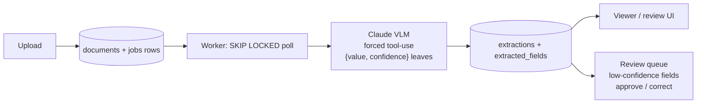

# doc-pilot

[](https://github.com/Antheagao/doc-pilot/actions/workflows/ci.yml)

AI document intelligence: upload messy real-world documents (receipts, invoices, IDs, forms) → a vision-language model extracts structured data → low-confidence fields route to a human review queue → clean data lands in Postgres with a full audit trail and per-document cost tracking.

<!-- LIVE_DEMO: hosted demo link goes here once a host is picked -->

212 mocked tests across three CI jobs (backend, frontend, compose config validation) run on every push -- see the badge above. A separate opt-in live smoke suite hits the real Anthropic API to catch drift a mock can't: `RUN_LIVE_SMOKE=1 pytest -m live` (from `backend/`), about $0.02 for a full run and hard-capped at $0.10 regardless.

## Screenshots


*The split view: the original document beside what the model extracted. Every field carries its own confidence score. The subtotal here was misread off a skewed phone photo at 68% confidence, routed to review, and corrected by a human — the model's original answer stays visible, struck through, beside the correction.*


*The review queue: only the individual fields that fell below the confidence threshold, not whole documents. Approve or correct inline; the header badge tracks pending count.*


*Upload via drag-and-drop and watch documents move `uploaded` → `processing` → `extracted`, polled live.*

## Stack

- **Backend:** FastAPI (Python)
- **VLM:** Claude via the Anthropic API — image input with structured outputs (JSON schema), never regex-parsing free text
- **Queue:** Postgres `SKIP LOCKED` job queue
- **Frontend:** Next.js — upload, extraction results side-by-side with the document image, review/correct UI

## Quickstart

The fastest path is the whole stack via Docker Compose -- no local Python or Node setup required.

```powershell
git clone <this repo> doc-pilot
cd doc-pilot

# compose reads ANTHROPIC_API_KEY from a repo-root .env for variable
# substitution (see .env.example). If you already have backend/.env from
# a previous local-dev setup, reuse it directly:
Copy-Item backend\.env .env          # Windows
# cp backend/.env .env               # macOS/Linux

# Fresh clone with no backend/.env yet? Start from the template instead,
# then edit .env and set ANTHROPIC_API_KEY=sk-ant-... (or just export
# ANTHROPIC_API_KEY in your shell -- compose falls back to that if no
# root .env is present):
# Copy-Item .env.example .env        # Windows
# cp .env.example .env               # macOS/Linux

docker compose up --build
```

Migrations run automatically -- a one-shot `migrate` service runs `alembic upgrade head` and `api`/`worker` wait on it before starting. Once the stack is up:

- Frontend: http://localhost:3000
- API: http://localhost:8000
- Postgres: `localhost:5434` (bound to loopback, `docpilot`/`docpilot`)

Open http://localhost:3000, upload a file from [`samples/`](samples/) (or generate fresh ones with `python backend/scripts/make_samples.py`), and watch it go `uploaded` -> `extracted` with per-field confidence.

> **Gotcha:** the frontend's `NEXT_PUBLIC_API_URL` is inlined into the JS bundle at *build* time (`frontend/Dockerfile`), not read at container start. Pointing the UI at a different API means rebuilding the image, not just restarting it: `docker compose build --build-arg NEXT_PUBLIC_API_URL=https://your-api frontend`.

### Local development (without Docker)

Three terminals, in order:

```powershell
git clone <this repo> doc-pilot
cd doc-pilot

# Postgres (host port 5434 -- 5432/5433 are already taken by other local
# projects, so the compose file remaps to avoid colliding with them)
docker compose up -d db

# Backend setup (one-time)
cd backend
python -m venv .venv
.venv\Scripts\Activate.ps1
pip install -e .[dev]
copy .env.example .env
# edit .env and set ANTHROPIC_API_KEY=sk-ant-...
alembic upgrade head
```

**Terminal 1 -- API** (from `backend/`, venv active):

```powershell
uvicorn app.main:app --reload
```

**Terminal 2 -- worker** (from `backend/`, venv active):

```powershell
python -m app.worker
```

**Terminal 3 -- frontend:**

```powershell
cd frontend
npm install
npm run dev
```

Open http://localhost:3000, upload a file from [`samples/`](samples/) (or generate fresh ones with `python backend/scripts/make_samples.py`), and watch it go `uploaded` -> `extracted` with per-field confidence.

## Architecture



This is the data-flow shape (what happens to a document), not the deployment topology -- for that, `docker compose up --build` runs five services: `db`, a one-shot `migrate`, `api`, `worker`, and `frontend` (see the Quickstart above and `docker-compose.yml`).

## Why these tech choices

- **Postgres `SKIP LOCKED` instead of Redis for the job queue.** One datastore to run, deploy, and explain instead of two. More importantly, the queue is transactional with the data it produces: a job row and its extraction rows commit or roll back together, so there's no window where the queue says "done" and the data disagrees. A worker that crashes mid-claim doesn't need a separate recovery system -- it's just a `processing` row that a future worker startup reconciles back to `pending` (`reclaim_orphaned_jobs()` in `app/worker.py`). Scaling out is "run more worker processes" -- with the honest caveat that today's startup orphan-reclaim assumes a single worker; running two concurrently would need that sweep to become claim-aware first (see the `worker` service comment in `docker-compose.yml`).
- **FastAPI / Python for the backend.** First-class SDKs for the pieces that matter here (the Anthropic SDK, async SQLAlchemy, Alembic); the workload is almost entirely I/O-bound waiting on VLM round-trips, which is exactly the case `async`/`await` is for.
- **Evals from day one.** No prompt version ships without a run against the labeled corpus in `evals/` -- the table in the [Evals](#evals) section below isn't hand-maintained, it's generated from committed run artifacts in `evals/results/`, each tied to the `(model, prompt_version, dataset_version)` triple it was produced with.
- **Per-field confidence, not a single document-level score, routed to a human review queue.** The extraction tool forces every leaf value into `{value, confidence}`, so review routes individual low-confidence *fields* to a human rather than re-doing an entire document. This is justified empirically, not just by preference: the `caught_by_review` column in the Evals Ops table shows Sonnet flags essentially all of its own misses with low confidence, while Haiku flags almost none of them. That asymmetry -- a model that mostly knows when it's wrong versus one that doesn't -- is the whole case for the queue existing.
- **Prompts as versioned files** (`backend/prompts/extract_v1.md`), not inline strings, so extraction rows and eval results can be tied to a specific prompt revision as prompts iterate. **Next.js as a thin client-side UI over a plain REST API** -- every page is a client component calling the FastAPI backend directly, no server components or BFF layer in between, which is also why the API URL has to be resolved to something the *browser* can reach at build time (see the Quickstart gotcha above).

## Human review

Fields extracted with confidence below `review_threshold` (default 0.8, see `backend/app/config.py`) are flagged `needs_review` and land in a field-level work queue -- `GET /review/queue` on the backend, the **Review** page (with a pending-count badge in the header) on the frontend. A reviewer either **approves** the extracted value or **corrects** it; either way the resolution is stamped with `reviewed_at` and `review_action`, and a correction is stored in `corrected_value` *beside* the model's original answer, never over it -- the audit trail keeps what the model actually said. Resolving the same field twice is a 409: the first human decision wins until someone deliberately revisits it.

The loop closes with `python scripts/harvest_corrections.py` (from `backend/`): every document whose flagged fields have all been resolved is exported as a new eval case under `evals/` -- corrections become the label, approved and high-confidence values are kept as-is, and each exported label records its `source_document_id` so re-running only harvests new documents. Every harvested label passes the same loud validation the eval loader applies before it is kept, so a hand-typed correction in the wrong format is rejected at harvest time instead of poisoning the dataset.

## Failure handling

Four independent recovery paths cover the ways a VLM call can go wrong, all in `backend/app/extraction.py`:

| Path | When it triggers | Recovery | Cost |
| --- | --- | --- | --- |
| Schema-repair reprompt (H3) | The model's `tool_use.input` violates the tool's schema (a bare scalar instead of `{value, confidence}`, a missing `value`, a non-numeric `confidence`) | Exactly one reprompt asking the model to fix only the structure; the repaired input replaces the original only if it has strictly fewer violations | One extra billed call, win or lose -- both calls' tokens are summed into the extraction |
| Refusal status (H4) | `response.stop_reason == "refusal"` | Raises a non-retryable `ModelRefusalError`; the document is marked `"refused"` instead of `"failed"` so the UI can tell a policy decline apart from a real error | The refusing call's tokens are billed and surfaced on the error, but the job is never retried -- the same request would refuse identically every time |
| Status-classified retries + retry-after (H5) | An `anthropic.APIStatusError` -- 429/529/5xx/408 are retryable, 400/401/403/404/413/422 are deterministic | Retryable statuses raise a plain `ExtractionError` that the Postgres job queue requeues with backoff, honoring any `retry-after` header as a floor; non-retryable statuses skip straight to permanent failure | No extra spend beyond the SDK's own in-process retry layer beneath this |
| PDF chunking + merge (H6) | A PDF's page count exceeds `pdf_max_pages_per_call` (default 5) | Split into one single-page PDF per page (`app/pdf.py`), extract each **sequentially**, then merge field-by-field -- highest-confidence value wins per field, ties broken by page order, and any real cross-page disagreement caps the merged confidence at 0.5 so it routes to human review | One billed call per page instead of one for the whole document; a page count over `pdf_max_pages` (default 20) is refused before any call is made |

## Security model

doc-pilot is currently a **single-user local tool** and its security posture is scoped to that: there is no authentication, because everything binds to localhost and the only user is the person running it. What *is* enforced regardless of deployment:

- **Uploads are verified, not trusted.** The client's Content-Type must be on the allowlist, the file's magic bytes must actually match that type (a payload claiming `image/png` without a PNG signature is rejected with 415), the storage filename is a server-generated UUID with an extension derived from the *verified* type (never from the client filename), and oversized bodies are aborted at the ASGI layer before they reach disk.
- **Re-serving is locked down.** Files are served back with their stored content type plus `X-Content-Type-Options: nosniff`, closing the stored-payload-served-as-image pattern from both ends.
- **No injection surfaces.** All SQL goes through the ORM with bound parameters; the frontend renders extracted values as React text nodes (VLM output is treated as untrusted data, never HTML); document content reaches the model under forced tool-choice with a fixed schema, and the eval corpus includes an adversarial prompt-injection case to measure that boundary.
- **The dev database binds to loopback only**, so its dev-grade credentials are never LAN-reachable.

**Before the hosted demo ships**, the threat model changes and three things become blocking: some form of auth (even a single bearer token), rate limiting with a daily spend cap (every upload triggers a billed VLM call — unauthenticated internet traffic means unbounded API spend at ~$0.01/document), and a storage quota with cleanup for uploads.

## Evals

Every extraction is scored against a synthetic-but-messy, PII-free corpus of labeled receipts/invoices in `evals/` -- generated with the correct answer known up front (not hand-transcribed from real documents), so the set doubles as a regression suite rather than a noisy guess. Each field has its own match rule: currency is an exact string match, dates are normalized to ISO-8601 before comparing, dollar amounts tolerate ±1 cent (compared in integer cents to dodge float rounding error), vendor names use fuzzy string matching (>=0.85 ratio), and line items must match item-for-item, in order. Every result is tied to the `(model, prompt_version, dataset_version)` triple it was produced with, so accuracy tracks across prompt iterations instead of floating in isolation -- the project rule is that a new prompt version only ships once an eval run proves it. The `caught_by_review` metric -- the share of incorrect fields the model itself flagged with low confidence -- is the empirical justification for routing low-confidence fields to a human review queue instead of trusting every extraction blindly.

Every extraction row records its own `cost_usd` and `latency_ms` (token counts times the model's per-token price), which is where every dollar figure in this README comes from -- there's no separate cost-tracking path to keep in sync. Two numbers show up elsewhere and are worth labeling so they don't read as contradictory: a single manual smoke extraction (`scripts/smoke.py`, one receipt) costs **~$0.009** on `claude-sonnet-5`, while the **$0.0125/doc** below is the **25-document eval mean** for that same model. Both are real; they differ because one is a single sample and the other is averaged across the labeled set -- the eval mean is the number to trust for planning per-document spend, not the one-off smoke run.

On this dataset Haiku costs ~2.4x less per document than Sonnet ($0.0052 vs $0.0125, both 25-document eval means) at a 4.0-point accuracy difference (95.4% vs 99.4%) -- the eval table is how that trade-off stays measurable as prompts change.

<!-- EVAL_TABLE:START -->

### Accuracy

| Model | Prompt | Docs | Overall | Vendor | Date | Currency | Subtotal | Tax | Total | Line items |
| --- | --- | --- | --- | --- | --- | --- | --- | --- | --- | --- |
| claude-sonnet-5 | extract_v1 | 3 | 100.0% | 100.0% | 100.0% | 100.0% | 100.0% | 100.0% | 100.0% | 100.0% |
| claude-sonnet-5 | extract_v1 | 25 | 99.4% | 100.0% | 100.0% | 96.0% | 100.0% | 100.0% | 100.0% | 100.0% |
| claude-haiku-4-5 | extract_v1 | 25 | 95.4% | 100.0% | 96.0% | 96.0% | 96.0% | 96.0% | 96.0% | 88.0% |

*Percentages are field-level accuracy (see this README's Evals section for the per-field match rules); Docs is n_scored for that run, with `+N err` appended when the run had N extraction errors. Each row is one eval run, tied to its own model / prompt_version / dataset_version, ordered oldest to newest by started_at_utc.*

### Ops

| Model | Prompt | Conf ✓/✗ | Caught by review | Halluc. | $/doc | Total $ | p50/p95 latency |
| --- | --- | --- | --- | --- | --- | --- | --- |
| claude-sonnet-5 | extract_v1 | 0.97 / n/a | n/a | 0 | $0.0110 | $0.0329 | 4368ms / 5943ms |
| claude-sonnet-5 | extract_v1 | 0.96 / 0.60 | 100.0% | 1 | $0.0125 | $0.3123 | 5165ms / 12929ms |
| claude-haiku-4-5 | extract_v1 | 0.96 / 0.93 | 0.0% | 1 | $0.0052 | $0.1305 | 3651ms / 8414ms |

*Conf ✓/✗ is mean model confidence on correct vs. incorrect fields; Caught by review is the share of incorrect fields whose confidence fell below that run's review_threshold -- the empirical case for the human-review queue; $/doc and Total $ are extraction spend in USD; latency is wall-clock p50/p95 per document.*

<!-- EVAL_TABLE:END -->

*Status: the full loop is working -- upload -> extract -> view -> human review -> corrections harvested back into the eval set -- and the whole stack runs with one command, `docker compose up --build`, with CI running the full test suite against Postgres on every push. Next: pick a host and ship the demo.*
